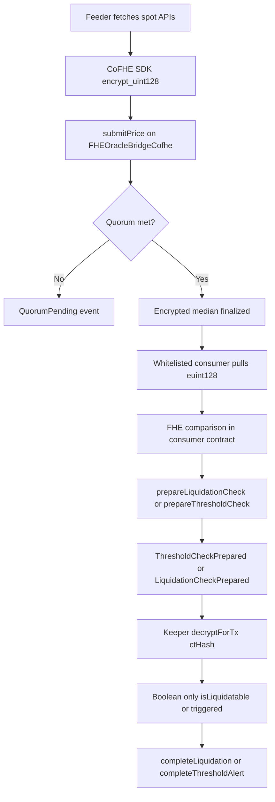
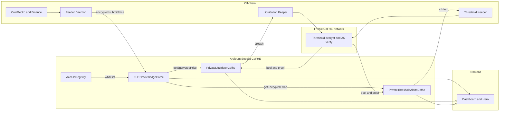
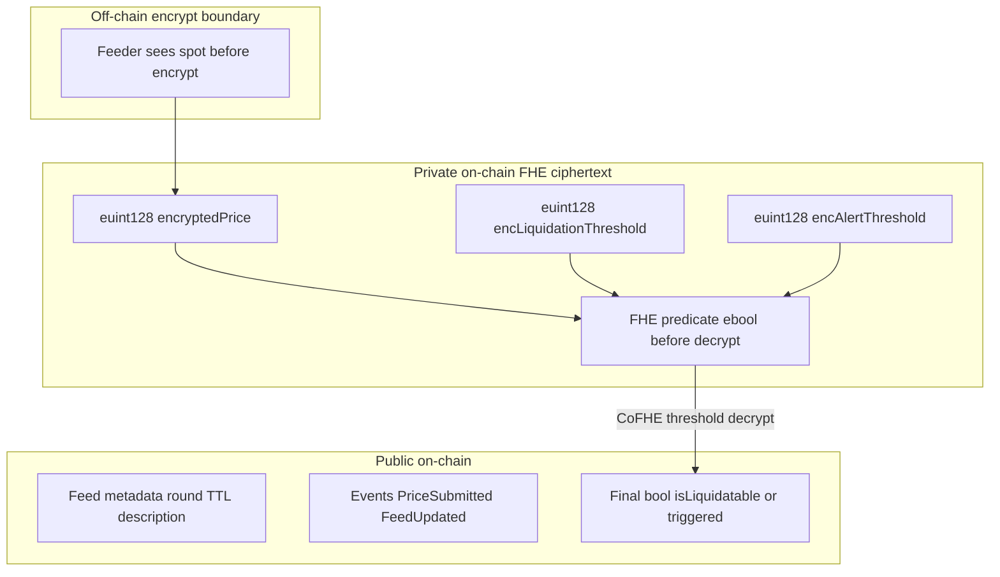
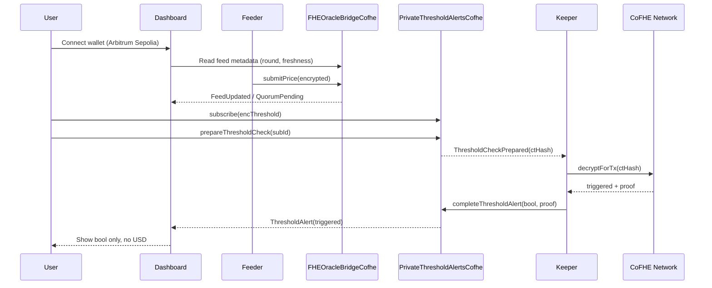
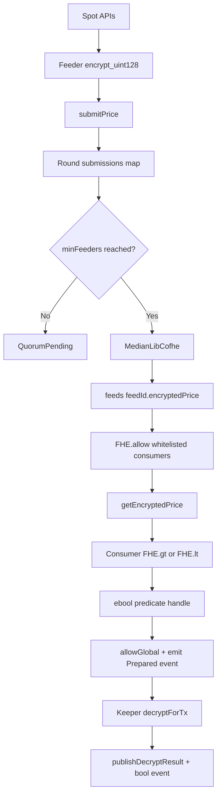
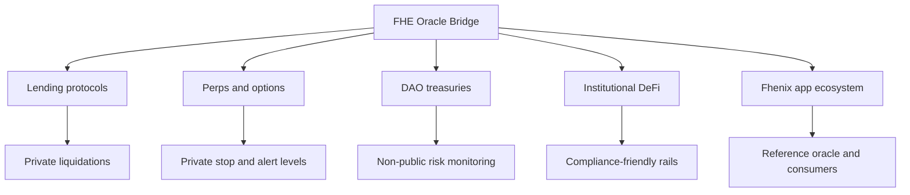
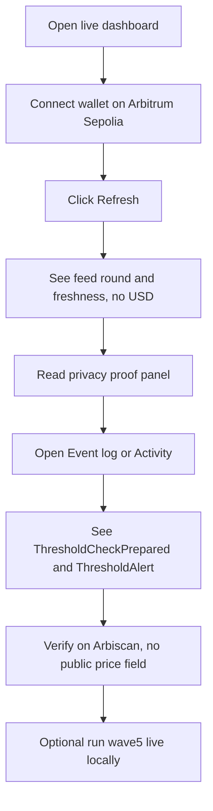

# FHE Oracle Bridge

**FHE Oracle Bridge** is a privacy-preserving price oracle built on [Fhenix CoFHE](https://fhenix.io). Instead of publishing plaintext USD ticks like a traditional oracle, it stores prices as **FHE ciphertext**, aggregates them with an **on-chain encrypted median**, and lets DeFi protocols act on **encrypted predicates** — liquidations and alerts reveal **only a boolean**, never spot or threshold values.

> FHE Oracle Bridge lets DeFi react to markets without broadcasting every price update to MEV bots.

---

## Build With

| Layer | How we use it |
|-------|----------------|
| **[Fhenix](https://fhenix.io)** | CoFHE contracts, threshold decrypt network, `@cofhe/sdk`, `@fhenixprotocol/cofhe-contracts` |
| **FHE** | `euint128` price storage, `FHE.gt` / `FHE.lt` / `FHE.select`, encrypted median in `MedianLibCofhe` |
| **Cryptography** | Client-side encryption before submit; CoFHE ZK proofs on decrypt; ACL via `FHE.allow` / `allowGlobal` |
| **Privacy** | No plaintext oracle field on-chain; whitelist-gated reads; boolean-only boundary for liquidation & alerts |

[](https://opensource.org/licenses/MIT)
[](https://soliditylang.org)
[](https://fhenix.io)
[](#testing)
[](https://fhe-oracle-bridge-demo.surge.sh/)

| | |
|---|---|
| **Live dashboard** | https://fhe-oracle-bridge-demo.surge.sh/ |
| **Network** | Arbitrum Sepolia (`421614`) |
| **Repository** | https://github.com/Nanle-code/fhe-oracle-bridge |
| **Oracle (Arbiscan)** | [`0x4c1A…26dC3`](https://sepolia.arbiscan.io/address/0x4c1A39704D65992464C4BE356c1A0BA001526dC3) |
| **Liquidator (Arbiscan)** | [`0x5d9D…f3ff`](https://sepolia.arbiscan.io/address/0x5d9DD91F4d8D8bF1c7Df801c6a0453316f4Af3ff) |
| **Threshold alerts (Arbiscan)** | [`0x8088…B1932`](https://sepolia.arbiscan.io/address/0x80886CCF7253337E1ABe911CD36f1F7BAAdB1932) |

---

## Table of Contents

- [Overview](#overview)
- [Why FHE Oracle Bridge](#why-fhe-oracle-bridge)
- [Problem](#problem)
- [Solution](#solution)
- [Core Features](#core-features)
- [How FHE Oracle Bridge Works](#how-fhe-oracle-bridge-works)
- [System Architecture](#system-architecture)
- [Privacy Architecture](#privacy-architecture)
- [FHE & CoFHE Integration](#fhe--cofhe-integration)
- [Encrypted Median](#encrypted-median)
- [Consumer Flows](#consumer-flows)
- [User Flow](#user-flow)
- [Data Flow](#data-flow)
- [Live Deployment](#live-deployment)
- [Dashboard](#dashboard)
- [Contracts](#contracts)
- [Integration Guide](#integration-guide)
- [Keeper & Feeder Operations](#keeper--feeder-operations)
- [Environment Variables](#environment-variables)
- [Installation](#installation)
- [Running Locally](#running-locally)
- [Live Testnet Demo](#live-testnet-demo)
- [Testing](#testing)
- [npm Scripts](#npm-scripts)
- [Project Structure](#project-structure)
- [Security & Privacy Rules](#security--privacy-rules)
- [Market Potential](#market-potential)
- [Roadmap](#roadmap)
- [Production Readiness](#production-readiness)
- [Quick Start Walkthrough](#quick-start-walkthrough)
- [Troubleshooting](#troubleshooting)
- [Resources](#resources)
- [License](#license)

---

## Overview

FHE Oracle Bridge is infrastructure for **private market data in DeFi**. It is designed for:

- Lending & borrowing protocols that need liquidation checks without public health factors
- Perps & options desks that want threshold alerts without leaking levels
- DAO treasuries monitoring portfolio risk privately
- Oracle integrators building on Fhenix CoFHE
- MEV-sensitive strategies that must not expose oracle ticks on-chain

**What it does:**

1. Feeders fetch spot (CoinGecko + Binance), **encrypt client-side**, and submit ciphertext to the oracle.
2. The oracle optionally aggregates multiple feeders with an **encrypted median** — still ciphertext.
3. Whitelisted consumer contracts pull encrypted prices and run **FHE comparisons**.
4. For CoFHE production paths, only a **single boolean** crosses the threshold-decrypt boundary (liquidatable? alert triggered?).

**What it does not do (v1):** arbitrary off-chain data feeds, large decentralized feeder economies, or a public `latestAnswer()` USD index.

**Repository includes:** Solidity (local mock + CoFHE + Fhenix variants), feeder/keeper automation, fintech dashboard, **42 Hardhat tests**, live E2E scripts, CI smoke workflows.

---

## Why FHE Oracle Bridge

FHE Oracle Bridge is built as **production-oriented privacy infrastructure** — not a public price ticker, but a full stack for encrypted market data, predicate consumers, and operator automation on Fhenix CoFHE.

### Privacy by Design

Spot prices and user thresholds never appear as plaintext on-chain. The only public outputs tied to sensitive comparisons are **booleans** after CoFHE threshold decrypt.

| Privacy layer | Implementation | Evidence |
|---------------|----------------|----------|
| Encrypted storage | `euint128 encryptedPrice` in `FHEOracleBridgeCofhe` | [`contracts/FHEOracleBridgeCofhe.sol`](./contracts/FHEOracleBridgeCofhe.sol) |
| Access control | `AccessRegistry` whitelist on `getEncryptedPrice` | [`contracts/AccessRegistry.sol`](./contracts/AccessRegistry.sol) |
| Encrypted aggregation | `MedianLibCofhe.encryptedMedian` — no plaintext median step | [`contracts/libraries/MedianLibCofhe.sol`](./contracts/libraries/MedianLibCofhe.sol) |
| Encrypted predicates | `FHE.gt` / `FHE.lt` inside consumer contracts | [`PrivateLiquidatorCofhe.sol`](./contracts/PrivateLiquidatorCofhe.sol), [`PrivateThresholdAlertsCofhe.sol`](./contracts/PrivateThresholdAlertsCofhe.sol) |
| Minimal reveal | `FHE.allowGlobal` + async `decryptForTx` → **bool only** | [`scripts/liquidationKeeper.js`](./scripts/liquidationKeeper.js), [`scripts/thresholdAlertKeeper.js`](./scripts/thresholdAlertKeeper.js) |
| Staleness guard | Per-feed TTL — metadata public, price ciphertext gated | `getEncryptedPrice` reverts when stale |

**Privacy boundary (one sentence):**  
Spot and user thresholds stay FHE ciphertext on-chain; keepers learn only `isLiquidatable` or `triggered` — not USD.

**Comparison vs transparent oracles:**

| Approach | Price private? | On-chain FHE? | Public tick? |
|----------|----------------|---------------|--------------|
| Chainlink-style | No | N/A | Yes |
| ZK / DECO | Partial | Off-chain proof | Partial |
| TEE oracle | Trust hardware | Yes | Partial |
| **FHE Oracle Bridge** | **Yes** | **Yes** | **No** |

---

### What We Built Differently

We are not another public index feed. FHE Oracle Bridge is a **predicate oracle rail** — protocols ask encrypted questions and get encrypted answers, with minimal plaintext leakage.

| Capability | Why it matters |
|------------|----------------|
| **On-chain encrypted median** | Multi-feeder aggregation without decrypting feeder submissions |
| **Predicate consumers** | Liquidation & alerts use comparisons, not public price reads |
| **Async CoFHE pattern** | `prepare → keeper decrypt bool → complete` — production-ready Fhenix flow |
| **Triple contract variants** | Same logic on Hardhat mock, CoFHE testnet, and Fhenix Helium |
| **Incremental delivery** | Milestones from encrypted ingest → access control → quorum → liquidation → alerts |

**Core differentiator:** Chainlink publishes `$3,500`. We publish `euint128` and let integrators compute `spot > threshold` entirely inside FHE.

---

### Dashboard & Developer Experience

Operators and integrators can verify privacy and liveness without reading Solidity first.

| UX surface | What the user sees |
|------------|-------------------|
| **[Live dashboard](https://fhe-oracle-bridge-demo.surge.sh/)** | Fintech hero + glass dashboard; feed round/age/freshness — **no plaintext USD** |
| **Wallet connect** | MetaMask on Arbitrum Sepolia; network switch helper |
| **Privacy proof panel** | Side-by-side Chainlink leak vs encrypted handles |
| **Event log** | `ThresholdCheckPrepared`, `ThresholdAlert`, `LiquidationCheckPrepared` — predicates + bools only |
| **One-command demos** | `npm run wave5:live`, `npm run wave4:live`, `npm run demo:preflight` |
| **Operator stack** | `npm run spin` — feeder + both keepers + frontend |

**Design intent:** The UI intentionally **does not** show spot USD — that is the product thesis, not a missing feature.

---

### Live on Testnet

The full stack runs on CoFHE testnet today — contracts deployed, automation wired, runbooks documented.

| Component | Status | Reference |
|-------------|--------|-------|
| CoFHE contracts deployed | ✅ | [Live deployment](#live-deployment) |
| 42 Hardhat tests | ✅ | `npm test` |
| Live liquidation E2E | ✅ | `npm run wave4:live` |
| Live threshold alert E2E | ✅ | `npm run wave5:live` |
| Feeder daemon (live APIs) | ✅ | [`scripts/feederDaemon.js`](./scripts/feederDaemon.js) |
| Liquidation + alert keepers | ✅ | [`scripts/liquidationKeeper.js`](./scripts/liquidationKeeper.js), [`scripts/thresholdAlertKeeper.js`](./scripts/thresholdAlertKeeper.js) |
| CI: Hardhat tests | ✅ | [`.github/workflows/hardhat-test.yml`](./.github/workflows/hardhat-test.yml) |
| CI: testnet smoke | ✅ | [`.github/workflows/testnet-smoke.yml`](./.github/workflows/testnet-smoke.yml) |
| CoFHE retry / wait helpers | ✅ | [`scripts/cofheWait.js`](./scripts/cofheWait.js), [`scripts/lib/cofheNetwork.js`](./scripts/lib/cofheNetwork.js) |

**Recorded live transactions (Arbitrum Sepolia):**

| Flow | Event | Tx |
|------|-------|-----|
| Threshold alerts | `ThresholdCheckPrepared` | [`0x98cd6091…`](https://sepolia.arbiscan.io/tx/0x98cd60918f517771c6f15393dbd56f02e15adf066b4abb41c76a548f0e859b43) |
| Threshold alerts | `ThresholdAlert` / complete | [`0x8edfcef0…`](https://sepolia.arbiscan.io/tx/0x8edfcef0aaebf2fedcd78c706acff80fc2b609f609b60379ee1a3bebed98ae33) |
| Private liquidation | `PositionOpened` (#3) | [`0x89d033ef…`](https://sepolia.arbiscan.io/tx/0x89d033ef02ab95168e5964f77d8bde0f280f08eb1f8f19ee2241b1111bfec49f) |
| Private liquidation | `LiquidationCheckPrepared` | [`0xa3f207ec…`](https://sepolia.arbiscan.io/tx/0xa3f207ec707501e616967256f83b1e7bf9c4645eaddf9cf95013df726dcbc8c2) |
| Private liquidation | `PositionLiquidated` / complete | [`0x4bebe95c…`](https://sepolia.arbiscan.io/tx/0x4bebe95c8b24f046a9ea9eed4a16725f68fcaa3ad505ca32fa3ad3efe1dadd51) |

---

## Problem

Traditional oracles expose plaintext prices to every observer:

```solidity
// Chainlink-style:
latestAnswer() → 350000000000   // $3,500.00 — visible to every bot
```

| Vulnerability | Impact |
|---------------|--------|
| **MEV front-running** | Bots read oracle updates before user txs settle |
| **Position hunting** | Visible liquidation thresholds get exploited |
| **Signal leakage** | Alert/stop levels inferable from on-chain behavior + public prices |
| **Institutional blocker** | Compliance & desk policy often forbid fully public financial rails |

Most oracle infrastructure optimizes for **price discovery transparency**.

FHE Oracle Bridge optimizes for **action privacy** — protocols need to know *whether* a condition is met, not broadcast *what* the exact tick is.

---

## Solution

FHE Oracle Bridge creates a **privacy layer between market data and DeFi execution**.

It helps protocols answer:

- Is spot above my encrypted threshold?
- Is this position liquidatable under encrypted spot?
- What is the encrypted median across feeders this round?
- Should we trigger an alert — **without** publishing X or spot USD?

**Solution stack:**

```
Feeder encrypts spot → Oracle stores euint128 → Consumer compares in FHE → CoFHE reveals bool only
```

---

## Core Features

### 1. Private Price Ingest

Feeders fetch ETH/USD and BTC/USD from CoinGecko + Binance, encrypt with `@cofhe/sdk`, and call `submitPrice(feedId, inEuint128)`.

- Only ciphertext lands on-chain
- Feeder must be registered and staked (≥ 0.01 ETH)
- Per-feed TTL staleness guard

---

### 2. Encrypted Median Aggregation

When `minFeeders ≥ 2`, multiple encrypted submissions finalize into one **encrypted median** via `MedianLibCofhe` — no feeder or observer sees another feeder's plaintext price on-chain.

---

### 3. Whitelist-Gated Encrypted Reads

`AccessRegistry` controls which consumer contracts may call `getEncryptedPrice`. Non-whitelisted callers revert.

---

### 4. Private Liquidation

`PrivateLiquidatorCofhe` stores encrypted liquidation thresholds. Flow:

```
openPosition → requestLiquidationCheck → keeper decrypts bool → completeLiquidation
```

Keeper learns **only** `isLiquidatable` — not spot or threshold USD.

---

### 5. Private Threshold Alerts

`PrivateThresholdAlertsCofhe` stores encrypted alert levels. Flow:

```
subscribe → prepareThresholdCheck → keeper decrypts bool → completeThresholdAlert
```

Only `triggered: true/false` is public after CoFHE decrypt.

---

### 6. Live Dashboard

Hosted fintech landing + operational dashboard:

- Feed freshness, round IDs, quorum progress
- Consumer activity stream (predicate events)
- Wallet connect on Arbitrum Sepolia
- Privacy proof comparison panel

---

## How FHE Oracle Bridge Works



---

## System Architecture



**Contract variants by network:**

| Network | Oracle | Liquidator | Alerts |
|---------|--------|------------|--------|
| Hardhat local | `FHEOracleBridge` | `PrivateLiquidator` | `PrivateThresholdAlerts` |
| Arbitrum / Base Sepolia (CoFHE) | `FHEOracleBridgeCofhe` | `PrivateLiquidatorCofhe` | `PrivateThresholdAlertsCofhe` |
| Fhenix Helium | `FHEOracleBridgeFhenix` | `PrivateLiquidatorFhenix` | — |

---

## Privacy Architecture



**What stays private:**

- Spot USD (on-chain storage)
- User liquidation / alert thresholds
- Feeder submission values (opaque ciphertext handles)
- Comparison operations (FHE precompile)

**What is public:**

- Feed metadata (round, age, quorum count)
- Event types and addresses (not USD values)
- **Final boolean** after authorized CoFHE decrypt

---

## FHE & CoFHE Integration

| Component | Package / service |
|-----------|-------------------|
| Solidity FHE types | `@fhenixprotocol/cofhe-contracts` |
| Client encryption | `@cofhe/sdk` (`Encryptable.uint128`) |
| Hardhat testing | `@cofhe/hardhat-plugin` + local `FHEMock` |
| Threshold decrypt | CoFHE network (`decryptForTx`) |
| ACL propagation | `FHE.allowThis`, `FHE.allow`, `FHE.allowGlobal` |

**Price encoding:** Chainlink-style 8 decimals — `$3,500.00` → `350000000000n`.

**ABI note:**

```solidity
// Local mock:
function submitPrice(uint256 feedId, uint256 encPrice);

// CoFHE production:
function submitPrice(uint256 feedId, InEuint128 calldata encPrice);
```

---

## Encrypted Median

When multiple feeders submit for a round, the oracle finalizes an encrypted median:

```solidity
// MedianLibCofhe — pairwise FHE.gt + FHE.select sort, return middle
euint128 aggregated = MedianLibCofhe.encryptedMedian(prices);
feeds[feedId].encryptedPrice = aggregated;
```

| | Chainlink-style | FHE Oracle Bridge |
|--|-----------------|-------------------|
| Median computed | Off-chain plaintext | On-chain ciphertext |
| On-chain value | `uint256` USD | `euint128` handle |
| Observer sees | Exact price | Opaque handle |

With `minFeeders >= 2`, partial rounds emit `QuorumPending` until quorum, then `FeedUpdated`.

---

## Consumer Flows

### Private Liquidation

```
openPosition(feedId, encLiqPrice)     → threshold stored as euint128
requestLiquidationCheck(positionId)   → FHE.gt(threshold, spot) → LiquidationCheckPrepared(ctHash)
keeper: decryptForTx(ctHash)          → learns ONLY isLiquidatable
completeLiquidation(id, bool, proof)  → collateral to keeper if true
```

### Threshold Alerts

```
subscribe(feedId, encThreshold, mode) → threshold stored as euint128
submitPrice (feeder)                  → encrypted spot updated
prepareThresholdCheck(subId)          → FHE.lt/gt → ThresholdCheckPrepared(ctHash)
keeper: decryptForTx(ctHash)          → learns ONLY triggered
completeThresholdAlert(subId, bool)   → ThresholdAlert event (bool only)
```

---

## User Flow



---

## Data Flow



---

## Live Deployment

Canonical addresses in [`frontend/config.json`](./frontend/config.json):

| Contract | Address |
|----------|---------|
| AccessRegistry | `0x3b01F41557C08587c83c1EcA40ef93bb6829D223` |
| FHEOracleBridge (CoFHE) | `0x4c1A39704D65992464C4BE356c1A0BA001526dC3` |
| MockConsumer | `0x2B826A58AB77E474c2A3a6C9B8cc521F33AA3d8c` |
| PrivateLiquidator | `0x5d9DD91F4d8D8bF1c7Df801c6a0453316f4Af3ff` |
| PrivateThresholdAlerts | `0x80886CCF7253337E1ABe911CD36f1F7BAAdB1932` |

| Feed ID | Pair |
|---------|------|
| `1` | ETH / USD |
| `2` | BTC / USD |

After redeploy: update `frontend/config.json`, `.env`, and republish dashboard (`npm run deploy:frontend:surge`).

---

## Dashboard

| | |
|---|---|
| **Live** | https://fhe-oracle-bridge-demo.surge.sh/ |
| **Local** | `npm run frontend` → http://127.0.0.1:8765/ |
| **Republish** | `npm run deploy:frontend:surge` |

**Pages / sections:**

| Section | Purpose |
|---------|---------|
| Hero | Fintech landing — value prop, wallet CTA, live feed metrics |
| Dashboard | Stats, privacy proof, live feed cards |
| Price feeds | Feed table with round & freshness |
| Access | Whitelisted consumers from `AccessRegistry` |
| Feeders | Feeder addresses from on-chain events |
| Event log | `PriceSubmitted`, `FeedUpdated`, predicate & bool events |

---

## Contracts

### `FHEOracleBridge*`

| Function | Access | Description |
|----------|--------|-------------|
| `createFeed(description, ttl, minFeeders)` | Owner | Create price feed |
| `submitPrice(feedId, encPrice)` | Feeder | Encrypted price submission |
| `getEncryptedPrice(feedId)` | Whitelisted | Returns `euint128` ciphertext |
| `getFeedInfo(feedId)` | Public | Metadata only — no price |
| `addFeeder` / `slash` / `pauseFeed` | Owner | Operations |

### `AccessRegistry`

| Function | Description |
|----------|-------------|
| `whitelist(consumer, label)` | Allow consumer to read encrypted prices |
| `revoke(consumer)` | Remove access |

Non-whitelisted `getEncryptedPrice` → `revert("Oracle: consumer not whitelisted")`.

### `PrivateLiquidator*`

Encrypted liquidation thresholds; CoFHE async `requestLiquidationCheck` → keeper `completeLiquidation`.

### `PrivateThresholdAlerts*`

Encrypted alert levels; CoFHE async `prepareThresholdCheck` → keeper `completeThresholdAlert`.

### `MockConsumer*`

Reference integration: `isPriceAbove`, `isPriceBelow`, `isWithinBand`.

---

## Integration Guide

### Step 1 — Import

```solidity
import "./interfaces/IFHEOracleBridgeCofhe.sol";
import "@fhenixprotocol/cofhe-contracts/FHE.sol";
```

### Step 2 — Whitelist

```solidity
registry.whitelist(address(myProtocol), "MyProtocol v1");
```

### Step 3 — CoFHE (production)

Use the **async** pattern — not sync `FHE.decrypt` in one tx:

```solidity
liquidator.openPosition(feedId, encLiqPrice, { value: collateral });
liquidator.requestLiquidationCheck(positionId);
// Keeper: decryptForTx(ctHash) → completeLiquidation(positionId, isLiquidatable, proof)
```

### Step 4 — Hardhat local (mock)

```solidity
euint128 price = oracle.getEncryptedPrice(1);
ebool isAbove = FHE.gt(price, threshold);
bool result = FHE.decrypt(isAbove);  // mock only
```

### Client encryption

```typescript
import { createCofheClient } from "@cofhe/sdk/node";
// encrypt_uint128 → submitPrice / openPosition / subscribe with InEuint128 payload
```

---

## Keeper & Feeder Operations

### Feeder daemon

```bash
npm run feeder:arbitrum-sepolia
# Env: PRIVATE_KEY, FHE_ORACLE_BRIDGE
# Optional: FEEDER2_PRIVATE_KEY for quorum
```

### Liquidation keeper

```bash
npm run keeper:arbitrum-sepolia
# Env: PRIVATE_LIQUIDATOR, KEEPER_POLL_MS=8000
```

### Threshold alert keeper

```bash
npm run keeper:threshold:arbitrum-sepolia
# Env: PRIVATE_THRESHOLD_ALERTS
```

### Always-on stack

```bash
npm run spin          # feeder + both keepers + frontend
npm run spin:stop
npm run spin:logs
```

---

## Environment Variables

Copy [`.env.example`](./.env.example) to `.env` or run:

```bash
npm run setup:env
```

```env
# Required for live demos
PRIVATE_KEY=your_private_key_here

# RPC
ARBITRUM_SEPOLIA_RPC=https://sepolia-rollup.arbitrum.io/rpc

# Contract addresses (from deploy or frontend/config.json)
ACCESS_REGISTRY=0x3b01F41557C08587c83c1EcA40ef93bb6829D223
FHE_ORACLE_BRIDGE=0x4c1A39704D65992464C4BE356c1A0BA001526dC3
MOCK_CONSUMER=0x2B826A58AB77E474c2A3a6C9B8cc521F33AA3d8c
PRIVATE_LIQUIDATOR=0x5d9DD91F4d8D8bF1c7Df801c6a0453316f4Af3ff
PRIVATE_THRESHOLD_ALERTS=0x80886CCF7253337E1ABe911CD36f1F7BAAdB1932

# Optional quorum feeders
# FEEDER2_PRIVATE_KEY=
# FEEDER3_PRIVATE_KEY=

# Liquidation demo tuning
# LIQ_PREMIUM_BPS=500
# CRASH_BPS=1500
# COLLATERAL_ETH=0.005

# Keeper tuning
# KEEPER_POLL_MS=8000
# FEEDER_INTERVAL_MS=60000
```

Never commit `.env` — it is gitignored.

---

## Installation

```bash
git clone https://github.com/Nanle-code/fhe-oracle-bridge
cd fhe-oracle-bridge
npm install
npm run setup:env
# Edit .env: set PRIVATE_KEY
```

---

## Running Locally

```bash
# Compile + test
npx hardhat compile
npm test

# Local demos (no testnet)
npx hardhat run scripts/demoFlow.js --network hardhat
npx hardhat run scripts/demoThresholdAlerts.js --network hardhat

# Dashboard
npm run frontend
# → http://127.0.0.1:8765/
```

---

## Live Testnet Demo

### Prerequisites

- `.env` with `PRIVATE_KEY` and contract addresses (match [`frontend/config.json`](./frontend/config.json))
- Arbitrum Sepolia ETH (~0.02+)
- Wallet must be a **registered feeder with ≥ 0.01 ETH stake** for price submissions

### Preflight

```bash
npm run demo:preflight
```

### Threshold alerts (live E2E)

```bash
npm run submit:live:arbitrum-sepolia   # refresh feeds if stale
npm run wave5:live
# or: npm run wave5:live:wait
```

**Success:** JSON output with `"success": true` and `completeTx` hash. Arbiscan shows `ThresholdCheckPrepared` → `ThresholdAlert`.

### Private liquidation (live E2E)

```bash
npm run wave4:live
# or: npm run wave4:live:wait
```

**Success:** `PositionOpened` → `LiquidationCheckPrepared` → `PositionLiquidated`.

### Split steps

```bash
npm run wave4:open
POSITION_ID=1 npm run wave4:finish

npm run alert:register:arbitrum-sepolia
npm run alert:prepare:arbitrum-sepolia
```

### CoFHE timeouts

```bash
npm run cofhe:wait
# then retry wave4:live:wait or wave5:live:wait
```

---

## Testing

```bash
npm test
```

| Area | Coverage |
|------|----------|
| Ingest | Encrypted submit, feeds, opaque storage |
| Access | Whitelist, staleness, consumer pull |
| Quorum | Multi-feeder quorum, encrypted median, staking/slash |
| Liquidation | `PrivateLiquidator` open / liquidate / keeper flow |
| Alerts | `PrivateThresholdAlerts` create / trigger / cancel |
| — | Gas profiling |

**42 tests passing.**

Indicative gas (local): `submitPrice` ~80–190k · `liquidate` ~60–68k

---

## npm Scripts

| Script | Purpose |
|--------|---------|
| `npm test` | Hardhat suite (42 tests) |
| `npm run setup:env` | Copy addresses from `frontend/config.json` → `.env` |
| `npm run demo:preflight` | RPC + CoFHE + feed health check |
| `npm run wave5:live` | Threshold alert live E2E |
| `npm run wave5:live:wait` | Wait for CoFHE, then threshold alert E2E |
| `npm run wave4:live` | Private liquidation live E2E |
| `npm run wave4:live:wait` | Wait for CoFHE, then liquidation E2E |
| `npm run submit:live:arbitrum-sepolia` | Refresh live ETH/BTC feeds |
| `npm run spin` | Feeder + keepers + frontend |
| `npm run testnet:smoke` | CI-style live validation |
| `npm run frontend` | Local dashboard |
| `npm run deploy:frontend:surge` | Publish Surge demo |
| `npm run deploy:arbitrum-sepolia` | Deploy full stack |

See [`package.json`](./package.json) for the full list.

---

## Project Structure

```text
fhe-oracle-bridge/
├── contracts/
│   ├── FHEOracleBridge.sol / FHEOracleBridgeCofhe.sol / FHEOracleBridgeFhenix.sol
│   ├── AccessRegistry.sol
│   ├── MockConsumer*.sol
│   ├── PrivateLiquidator*.sol
│   ├── PrivateThresholdAlerts*.sol
│   ├── libraries/MedianLib*.sol
│   └── mocks/FHEMock.sol
├── scripts/
│   ├── deploy.js
│   ├── feederDaemon.js
│   ├── liquidationKeeper.js
│   ├── thresholdAlertKeeper.js
│   ├── wave4LiveE2E.js
│   ├── wave5LiveE2E.js
│   ├── spin.sh
│   ├── testnetSmoke.js
│   └── lib/
├── frontend/
│   ├── index.html
│   └── config.json
├── test/FHEOracleBridge.test.js
├── .github/workflows/
├── hardhat.config.js
└── package.json
```

---

## Security & Privacy Rules

FHE Oracle Bridge follows these rules:

1. **No plaintext price in contract storage or public fields.**
2. **No sync `FHE.decrypt` on CoFHE testnet** — use async keeper pattern.
3. **Only booleans cross the CoFHE threshold boundary** for liquidation and alerts.
4. **Whitelisted consumers only** may call `getEncryptedPrice`.
5. **Per-feed TTL** — stale ciphertext cannot be consumed.
6. **Feeders bond ETH** — slashable for misbehavior (owner-controlled v1).
7. **Feeders see spot before encrypting** — on-chain privacy holds; off-chain feeder honesty is a trust assumption.
8. **Never commit `PRIVATE_KEY`** or `.env` to git.

| Threat | Mitigation |
|--------|------------|
| MEV on oracle tick | No public USD field |
| Unauthorized read | `AccessRegistry` |
| Stale prices | TTL revert |
| Feeder griefing | Stake + slash |
| Feed DoS | `pauseFeed` / `resumeFeed` |

**Production hardening (future):** multisig owner, pending-check timeouts, verified contracts, decentralized keeper market.

---

## Market Potential

Public oracle ticks are a structural MEV and compliance problem. Private predicate oracles unlock use cases that cannot live on transparent rails.

| Segment | Pain today | FHE Oracle Bridge value |
|---------|------------|-------------------------|
| **Lending** | Liquidation bots hunt visible health factors | Encrypted threshold + bool-only liquidations |
| **Perps / options** | Stop levels leak via public oracles | Private threshold alerts |
| **Institutional DeFi** | Compliance blocks fully public price rails | Ciphertext storage + whitelist access |
| **MEV-sensitive DAOs** | Treasury rebalancing signals front-run | No public USD tick on-chain |
| **Fhenix ecosystem** | Needs reference oracle + consumer patterns | Deployed stack + integration guide |

**Integrators:** Any whitelisted Solidity consumer on CoFHE can pull `euint128` and run native FHE ops — lending, perps, structured products, risk engines.

**Business model (future):** feeder staking fees, keeper marketplace, whitelist SaaS for consumer onboarding, SLA feeds for private predicates.



**Why now:** CoFHE on L2 testnets makes FHE predicates practical. Public oracle ticks remain the default — creating a clear gap for privacy-first infrastructure.

---

## Roadmap

**Shipped**

- Encrypted ingest and feeds
- AccessRegistry and dashboard
- Multi-feeder encrypted median
- Private liquidation and keeper
- Threshold alerts and keeper

**Next**

- Verified contracts on Arbiscan
- Multi-feeder production (3+ feeder quorum)
- Keeper incentives and economic security

**Future**

- Multisig governance (owner to timelock)
- Cross-chain feeds (Base and Arbitrum parity)
- Integrator SDK (npm package for consumer devs)

---

## Production Readiness

What is shipped and verified today:

- [x] CoFHE contracts deployed on Arbitrum Sepolia
- [x] Live liquidation E2E
- [x] Live threshold alert E2E
- [x] 42 Hardhat tests passing
- [x] Feeder daemon (live CoinGecko + Binance)
- [x] Liquidation + threshold keepers
- [x] Live dashboard (fintech hero + operational UI)
- [x] CI: Hardhat tests + testnet smoke
- [x] Documentation (README, integration guide, runbooks)
- [x] `.env.example` + `npm run setup:env`
- [ ] Demo video (optional — add link here)

### Engineering

- [x] All npm demo scripts documented
- [x] No plaintext price in UI by design
- [x] Privacy proof panel on dashboard
- [x] Arbiscan links for deployed contracts
- [x] CoFHE retry helpers for flaky testnet
- [ ] Contract verification on Arbiscan (optional)

---

## Quick Start Walkthrough



**Try it in 5 minutes:**

1. https://fhe-oracle-bridge-demo.surge.sh/
2. Connect wallet → Refresh
3. Privacy proof + live feed cards
4. Event log → predicate + bool events
5. [Oracle on Arbiscan](https://sepolia.arbiscan.io/address/0x4c1A39704D65992464C4BE356c1A0BA001526dC3) — no `latestAnswer` USD field

---

## Troubleshooting

| Issue | Fix |
|-------|-----|
| `ZK_VERIFY_FAILED` / CoFHE timeout | `npm run cofhe:wait` then `wave5:live:wait` / `wave4:live:wait` |
| Stale feeds | `npm run submit:live:arbitrum-sepolia` or `npm run spin` |
| `Feed did not update after submitPrice` | Wallet must be registered feeder with ≥ 0.01 ETH stake |
| `Quorum pending` | Add `FEEDER2_PRIVATE_KEY` or deploy with `minFeeders=1` |
| `consumer not whitelisted` | Re-run deploy or `registry.whitelist` |
| `Set POSITION_ID` | `POSITION_ID=N npm run wave4:finish` |
| Low ETH | [Arbitrum Sepolia faucet](https://www.alchemy.com/faucets/arbitrum-sepolia) |
| Wrong dashboard contracts | Sync `frontend/config.json` with `.env` |

---

## Resources

- [Fhenix Docs](https://docs.fhenix.io)
- [CoFHE Quick Start](https://cofhe-docs.fhenix.zone/fhe-library/introduction/quick-start)
- [CoFHE Architecture](https://cofhe-docs.fhenix.zone/deep-dive/cofhe-components/overview)
- [Awesome Fhenix](https://github.com/FhenixProtocol/awesome-fhenix)
- [Fhenix Faucet](https://faucet.fhenix.zone)

---

## License

MIT © 2025 FHE Oracle Bridge

---

## One-Line Summary

**FHE Oracle Bridge is a Fhenix CoFHE price oracle that stores encrypted market data on-chain, aggregates with an encrypted median, and lets DeFi protocols liquidate and alert via FHE predicates that reveal only a boolean — never a public USD tick.**
